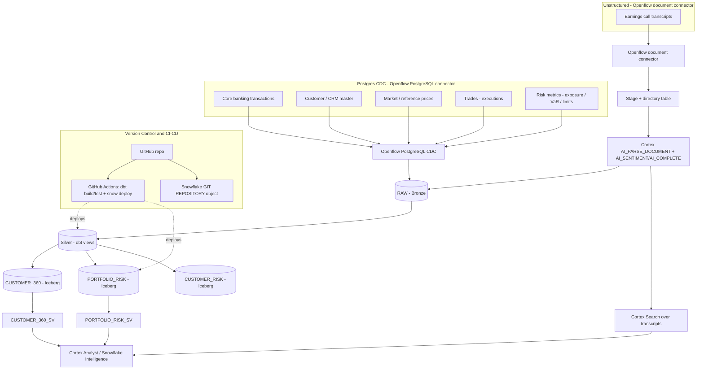

# Finance DE Demo — CoCo Data Engineering on Snowflake

End-to-end demo showing how **Cortex Code (CoCo)** builds a governed data-engineering
stack on Snowflake for a financial services use case:



See [docs/ARCHITECTURE.md](docs/ARCHITECTURE.md) for the standalone diagram.

## Data sources (Bronze)
1. **Core banking transactions** — account debits/credits/transfers (Postgres CDC)
2. **Customer / CRM master** — customer profile, segment, KYC (Postgres CDC)
3. **Market / reference data** — instrument prices & FX rates (Postgres CDC)
4. **Trades** — trade executions from the trading/risk system (Postgres CDC)
5. **Risk metrics** — per-customer exposure, VaR, limit breaches (Postgres CDC)
6. **Earnings call transcripts** — unstructured PDFs via Openflow document connector, parsed with Cortex

## Layers
| Layer | Location | Built by |
|-------|----------|----------|
| Bronze (RAW) | `FINANCE_DE_DEMO.RAW` | Openflow CDC connector |
| Silver | `FINANCE_DE_DEMO.STAGING` | dbt models |
| Gold | `MARTS.CUSTOMER_360`, `MARTS.PORTFOLIO_RISK`, `MARTS.CUSTOMER_RISK` (Iceberg) | dbt |
| Semantic / AI | `SEMANTIC.*_SV` semantic views + `SEMANTIC.EARNINGS_SEARCH` Cortex Search | dbt / SQL |

## Repo layout
- `sql/setup/` — environment DDL (database, schemas, warehouse, external volume)
- `sql/semantic/` — semantic view definition
- `openflow/` — Openflow flow definitions (config-as-code) + source data generators
- `dbt/finance_de_demo/` — dbt project (Bronze -> Silver -> Gold Iceberg)
- `.github/workflows/` — GitHub Actions CI/CD (dbt build + test + deploy)
- `DEMO_RUNBOOK.md` — internal run/reset steps and the CoCo prompts used to build it
- `CUSTOMER_WALKTHROUGH.md` — customer-facing showcase narrative

## Prerequisites
- `snow` CLI connection named `default` pointing at the account
- External volume `MY_EXTERNAL_VOL` (example: `s3://jh-iceberg/tt`)

## Quickstart
```bash
snow sql -c default -f sql/setup/00_environment.sql
snow sql -c default -f sql/setup/10_raw_landing.sql
snow sql -c default -f sql/setup/11_raw_trades_risk.sql
snow sql -c default -q "CREATE STAGE IF NOT EXISTS FINANCE_DE_DEMO.RAW.DOC_STAGE DIRECTORY=(ENABLE=TRUE) ENCRYPTION=(TYPE='SNOWFLAKE_SSE');"
snow sql -c default -q "PUT file://openflow/sample_docs/*.pdf @FINANCE_DE_DEMO.RAW.DOC_STAGE AUTO_COMPRESS=FALSE OVERWRITE=TRUE;"
snow sql -c default -f sql/setup/12_docs_ingest.sql
snow dbt deploy finance_de_demo --source dbt/finance_de_demo --database FINANCE_DE_DEMO --schema PUBLIC -c default
snow dbt execute -c default --database FINANCE_DE_DEMO --schema PUBLIC finance_de_demo build
snow sql -c default -f sql/semantic/customer_360_semantic_view.sql
snow sql -c default -f sql/semantic/portfolio_risk_semantic_view.sql
snow sql -c default -f sql/semantic/earnings_search.sql
```
See `DEMO_RUNBOOK.md` for the full narrated flow.
