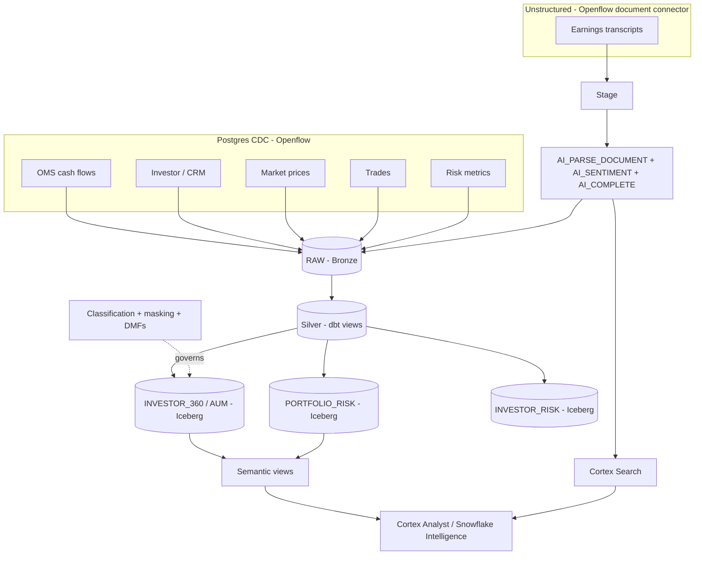

# SPECIFICATION — AI-Driven Data Engineering Demo for an Asset Manager

**Purpose of this document.** A build specification that a coding agent (e.g., Cortex Code /
CoCo) can execute to construct this entire stack from scratch, and that a human can read to
understand what is being built and why. It is written as requirements (MUST / SHOULD /
MAY per RFC 2119) with per-phase objectives, the natural-language prompt to drive the agent,
concrete deliverables, and acceptance criteria.

---

## 1. Intent and north star

Build a governed, AI-ready data platform for a fictional **asset management firm**
("Meridian Asset Management"), and use it to demonstrate **AI *for* Data Engineering** on
Snowflake. The differentiator is not that the platform serves AI at the end — it is that
**AI builds and operates the data engineering itself**:

1. **Build** — the agent authors the ingestion config, dbt models + tests, Iceberg DDL,
   semantic views, governance, and CI/CD from plain-English intent.
2. **Process** — Cortex AISQL functions are transformation steps inside the pipeline
   (documents become structured, governed columns).
3. **Serve** — semantic views + search make the outputs answerable in natural language.

Everything runs on Snowflake, stored in open Apache Iceberg, versioned in Git, promoted by CI/CD.

## 2. Audience and personas
- **Data engineering lead** — builds the platform conversationally.
- **Portfolio manager** — needs Investor 360 (AUM) and portfolio positions with research signal.
- **Risk officer** — needs exposure, VaR, limit breaches, and to search the research.
- **Governance / compliance** — needs PII classification, masking, lineage, data quality.

## 3. Parameters (fill in per environment)

The agent MUST treat these as configuration and substitute consistently. Defaults reflect the
reference build.

| Parameter | Default | Notes |
|-----------|---------|-------|
| `ACCOUNT` | `SFSENORTHAMERICA-DEMO_JHILL` | Snowflake account |
| `CONNECTION` | `default` | `snow` CLI connection (role ACCOUNTADMIN, key-pair auth) |
| `DB` | `FINANCE_DE_DEMO` | demo database |
| `WAREHOUSE` | `FINANCE_DE_DEMO_WH` | XS, auto-suspend 60s |
| `EXTERNAL_VOLUME` | `MY_EXTERNAL_VOL` | pre-existing, verified; backs Iceberg |
| `GIT_OWNER/REPO` | `jordandhill/finance-de-demo` | public GitHub repo |
| `GIT_API_INTEGRATION` | `GITHUB_API_INTEGRATION` | existing API integration |
| `CORTEX_LLM` | `llama3.1-70b` | model for `AI_COMPLETE` (region-available) |
| `DEMO_ROLE` | `FINANCE_ANALYST_RL` | low-privilege role for masking demo |

## 4. Prerequisites and assumptions
- Snowflake account in an AWS commercial region with Cortex AISQL, Cortex Search, Horizon
  lineage, and Iceberg enabled; role `ACCOUNTADMIN`.
- `snow` CLI (Snowflake CLI) and `gh` CLI installed and authenticated; a tool to render text to
  PDF (macOS `cupsfilter`) for sample documents.
- An **external volume** for Iceberg already exists and passes `SYSTEM$VERIFY_EXTERNAL_VOLUME`.
  If not, provisioning it (S3/Azure/GCS + IAM) is a prerequisite task.
- **Openflow runtime**: a live runtime is provisioned only via the Control Plane UI. If none
  exists, the spec's ingestion is delivered as **connector config-as-code** plus a
  **representative RAW landing** with an identical contract (see R3).

## 5. Architecture

## 6. Data model

**Sources (Bronze, `DB.RAW`)** — six sources, five relational via Postgres CDC + one unstructured:

| Source | Table | Key fields |
|--------|-------|-----------|
| OMS cash flows | `RAW.TRANSACTIONS` | txn_id, customer_id, txn_type (DEPOSIT/WITHDRAWAL/TRADE_BUY/TRADE_SELL/FEE), symbol, quantity, amount, balance_after, txn_ts |
| Investor / CRM | `RAW.CUSTOMERS` | customer_id, first_name, last_name, email, segment (INSTITUTIONAL/PENSION/ENDOWMENT/HNW/WEALTH), kyc_status, risk_rating, country, onboarded_date |
| Market prices | `RAW.INSTRUMENT_PRICES` | symbol, asset_class, price, currency, as_of_date |
| Trades | `RAW.TRADES` | trade_id, customer_id, symbol, side, quantity, price, notional, book, status, trade_ts |
| Risk metrics | `RAW.RISK_METRICS` | customer_id, as_of_date, gross_exposure, net_exposure, var_95, risk_limit, limit_breach_flag |
| Earnings transcripts | `RAW.EARNINGS_TRANSCRIPTS_RAW` | file_name, symbol, fiscal_period, parsed_text |

All CDC-landed tables MUST carry `_snowflake_inserted_at`, `_snowflake_deleted` metadata columns.

**Gold products (Iceberg, `DB.MARTS`)**:
- `INVESTOR_360` — one row/investor: profile + cash flows (subscriptions/redemptions/fees) +
  `assets_under_management` (cash_balance + holdings_value).
- `PORTFOLIO_RISK` — investor x instrument: net position, market value, gross_exposure,
  unrealized_pnl, plus the instrument's `earnings_sentiment`/`earnings_summary`.
- `INVESTOR_RISK` — investor-level exposure, var_95, risk_limit, limit_breach_flag.

## 7. Requirements by phase

Each phase: **objective**, the **agent prompt** (natural language the agent acts on),
**deliverables**, and **acceptance criteria (AC)**.

### R0 — Environment
- **Objective:** create the database, layered schemas, warehouse; verify Iceberg storage.
- **Prompt:** "Set up `DB` with RAW, STAGING, MARTS, SEMANTIC schemas and an XS warehouse, and
  verify the external volume `EXTERNAL_VOLUME`."
- **Deliverables:** `sql/setup/00_environment.sql`.
- **AC:** schemas exist; `SYSTEM$VERIFY_EXTERNAL_VOLUME('EXTERNAL_VOLUME')` returns all PASSED.

### R1 — Version control
- **Objective:** Git repo + Snowflake git integration.
- **Prompt:** "Create a GitHub repo and register it as a Snowflake GIT REPOSITORY."
- **Deliverables:** initialized repo pushed to `GIT_OWNER/REPO`; `GIT REPOSITORY` object.
- **AC:** `SHOW GIT BRANCHES` lists `main`; repo public (or credentialed secret if private).

### R2 — Ingestion source definitions (config-as-code)
- **Objective:** author Openflow connector configs for the six sources.
- **Prompt:** "Build Openflow PostgreSQL CDC config landing the five relational sources into
  RAW, and a document-connector config for earnings transcripts."
- **Deliverables:** `openflow/postgres_sample_data.sql`, `openflow/connector_config.md`,
  `openflow/earnings_docs_connector.md`.
- **AC:** configs enumerate all six sources, publication, EAI, and destination mapping.

### R3 — Bronze landing
- **Objective:** land representative data matching the connector contract (live runtime optional).
- **Prompt:** "Land representative CDC data for all sources into RAW with the connector's schema."
- **Deliverables:** `sql/setup/10_raw_landing.sql`, `11_raw_trades_risk.sql`, `12_docs_ingest.sql`;
  sample transcript PDFs in `openflow/sample_docs/`.
- **AC:** row counts > 0 for all six RAW tables; referential integrity (trades/txns reference
  existing customers and instruments); transcripts parsed via `AI_PARSE_DOCUMENT`.

### R4 — Transformation (dbt on Snowflake)
- **Objective:** Silver staging + Gold Iceberg marts, deployed and run natively.
- **Prompt:** "Create a dbt project: cleanse each source in Silver; build INVESTOR_360 (AUM),
  PORTFOLIO_RISK, and INVESTOR_RISK as Snowflake-managed Iceberg tables. Add tests. Deploy and
  run with `snow dbt`."
- **Deliverables:** `dbt/finance_de_demo/**` (project, profiles, macro, staging + marts, schema tests).
- **AC:** `snow dbt execute ... build` passes with 0 errors; all three marts appear in
  `SHOW ICEBERG TABLES` as MANAGED; tests include not_null/unique/relationships/accepted_values.

### R5 — AI as a transformation step
- **Objective:** turn unstructured research into governed structured signal.
- **Prompt:** "Parse the transcripts with Cortex, score sentiment and summarize outlook, and
  blend each instrument's sentiment into PORTFOLIO_RISK."
- **Deliverables:** `stg_earnings_transcripts` (uses `AI_SENTIMENT`, `AI_COMPLETE`); sentiment
  columns in `PORTFOLIO_RISK`.
- **AC:** every transcript row has a sentiment in {positive,negative,neutral,mixed} and a
  one-line summary; positions join to sentiment for covered symbols.

### R6 — AI-ready serving
- **Objective:** semantic views + Cortex Search.
- **Prompt:** "Create semantic views over the gold tables and a Cortex Search service over the
  transcripts."
- **Deliverables:** `sql/semantic/investor_360_semantic_view.sql`,
  `portfolio_risk_semantic_view.sql`, `earnings_search.sql`.
- **AC:** `SELECT ... FROM SEMANTIC_VIEW(...)` returns sensible aggregates; `SEARCH_PREVIEW`
  returns relevant transcripts for a natural-language query.

### R7 — Lineage
- **Objective:** demonstrate end-to-end lineage.
- **Prompt:** "Show lineage from the gold products back to the raw sources."
- **AC:** `SNOWFLAKE.CORE.GET_LINEAGE` traces each gold table to its RAW sources, including the
  unstructured transcripts.

### R8 — Governance
- **Objective:** classify PII, mask it dynamically, monitor data quality.
- **Prompt:** "Auto-classify PII on the investor data, apply tag-based dynamic masking so a
  low-privilege analyst sees masked values, and add data-quality metric functions."
- **Deliverables:** `sql/governance/00_role.sql` (demo role), `10_classify.sql`
  (`EXTRACT_SEMANTIC_CATEGORIES` + `ASSOCIATE_SEMANTIC_CATEGORY_TAGS`; explicit tags on name
  columns and on Iceberg columns via `ALTER ICEBERG TABLE`), `20_masking_policies.sql`
  (tag-based masking via a **scoped custom tag** — not the system tag, see constraint 12),
  `30_dmfs.sql` (system DMFs + one custom DMF). Deploy as a one-time bootstrap (constraint 10).
- **AC:** `DEMO_ROLE` sees masked email/name; ACCOUNTADMIN sees clear; a custom DMF returns a
  number and system DMF results land in `SNOWFLAKE.LOCAL.DATA_QUALITY_MONITORING_RESULTS`.

### R9 — Iceberg interoperability
- **Objective:** prove the open format + provide external-engine access recipes.
- **Prompt:** "Prove the gold tables are open Iceberg and document how Spark/PyIceberg/Databricks
  read them; template a catalog integration for external writes."
- **Deliverables:** `sql/iceberg_interop/inspect_iceberg.sql`, `docs/ICEBERG_INTEROP.md`.
- **AC:** `SYSTEM$GET_ICEBERG_TABLE_INFORMATION` returns a metadata location; doc contains a
  runnable PyIceberg recipe and commented Catalog Integration / Open Catalog templates.

### R10 — CI/CD
- **Objective:** version everything; test on PR; deploy on merge.
- **Prompt:** "Add GitHub Actions to build+test dbt on every PR and deploy the semantic views on
  merge to main."
- **Deliverables:** `.github/workflows/finance-de-cicd.yml`; secrets `SNOWFLAKE_ACCOUNT`,
  `SNOWFLAKE_USER`, `SNOWFLAKE_PRIVATE_KEY`.
- **AC:** a PR triggers a green build/test; merge deploys semantic views.

## 8. Cross-cutting constraints (the agent MUST honor)

These are non-obvious rules learned building the reference stack. Violating them causes silent
failures.

1. **Iceberg types:** cast Cortex `AI_*` outputs to `::STRING` (Iceberg rejects `VARIANT`); use
   `TIMESTAMP_NTZ(6)` (Iceberg rejects scale 9).
2. **dbt-on-Snowflake:** `profiles.yml` MUST include `role` and `account`; set
   `flags: enable_iceberg_materializations: true`; in `snow dbt execute` the `-c CONNECTION`
   flag MUST precede the project name.
3. **Document AI:** the stage backing `AI_PARSE_DOCUMENT` MUST be `ENCRYPTION=(TYPE='SNOWFLAKE_SSE')`;
   call as `AI_PARSE_DOCUMENT(TO_FILE('@stage', relative_path), {'mode':'LAYOUT'}):content::STRING`.
4. **Cortex model availability is regional:** do not assume `claude-*`; default to `CORTEX_LLM`.
   Use unprefixed `AI_*` function names.
5. **Tagging Iceberg tables:** use `ALTER ICEBERG TABLE ... MODIFY COLUMN ... SET TAG`
   (the auto-classification stored proc uses `ALTER TABLE` and fails on Iceberg tables).
6. **Dynamic masking is enforced at Snowflake query time only** — an external engine reading raw
   Parquet bypasses it. State this explicitly; the answer for open-format governance is Snowflake
   Open Catalog / external policies.
7. **Git API integration** may restrict allowed secrets; a public repo needs no credential on the
   `GIT REPOSITORY`.
8. **Network policy:** if CI auth is blocked by IP, add the Snowflake-managed GitHub rule to the
   active account network policy (additively) or use a dedicated CI user with a GitHub-allowing
   policy. This may need periodic re-application on shared accounts.
9. **Idempotency:** setup + ingestion + dbt + semantic SQL SHOULD use `CREATE ... IF NOT EXISTS`
   / `CREATE OR REPLACE` and be rebuildable from a single ordered script. **Exception:** the
   governance layer (constraint 10) is a bootstrap and is not re-runnable in place.
10. **Governance is a one-time bootstrap, NOT per-merge CI:** once a masking policy is attached
    to a tag and DMFs to columns, `CREATE OR REPLACE MASKING POLICY` fails while in use and
    `ADD DATA METRIC FUNCTION` errors on re-add. To reset: `ALTER TAG ... UNSET MASKING POLICY`
    and `DROP`/re-add DMFs first. Keep governance out of the CI deploy job.
11. **Custom DMF syntax:** a DATA METRIC FUNCTION body uses `RETURNS NUMBER AS $$ SELECT ... $$`,
    NOT the `->` arrow (that is for masking / row-access policies).
12. **Masking on shared accounts:** attach masking policies to a **scoped custom tag** you set
    only on your columns. Do NOT attach to the system `SNOWFLAKE.CORE.PRIVACY_CATEGORY` /
    `SEMANTIC_CATEGORY` tags — that would mask classified PII account-wide across other databases.
13. **Classification / DMF availability:** `SYSTEM$CLASSIFY` may be unavailable — use
    `EXTRACT_SEMANTIC_CATEGORIES` + `ASSOCIATE_SEMANTIC_CATEGORY_TAGS` (the latter uses
    `ALTER TABLE`, so tag Iceberg columns manually). Some system DMFs (e.g. `SNOWFLAKE.CORE.FRESHNESS`)
    may not be authorized in all regions — verify before attaching. `CREATE TAG` needs `COMMENT = '...'`.

## 9. Definition of done (global)
- One command sequence rebuilds the core stack (env -> ingestion -> dbt -> semantic) on a clean
  `DB` (see BUILD.md §5). Governance deploys as a separate one-time bootstrap (constraint 10).
- All six RAW sources populated; dbt build green; three Iceberg marts MANAGED.
- Two semantic views + one Cortex Search service answer natural-language questions.
- Lineage resolves gold -> raw for structured and unstructured sources.
- Governance: masking demonstrably differs by role; DMFs produce results.
- Interop: open-format proof + external-engine recipes documented.
- CI green on PR and on merge to main.

## 10. Deliverable docs (human-facing)
- `BUILD.md` — the executable build guide (as-built).
- `CUSTOMER_WALKTHROUGH.md` — the ~20-min customer talk track (per-Act CoCo prompts + "AI did
  the engineering here" callouts).
- `docs/ARCHITECTURE.md` — rendered architecture diagram.

## 11. Non-goals / out of scope
- A live Openflow runtime, live external Databricks/Spark cluster, or real customer data.
- Production hardening (secrets management beyond demo key-pair, cost controls, HA/DR).
- Streaming ingestion (narrated as a capability; not implemented).

## 12. Suggested build order for the agent
`R0 -> R1 -> R2 -> R3 -> R4 -> R5 -> R6 -> R7 -> R10 -> R8 -> R9`
(CI can be added once dbt + semantic layers exist; governance and interop are additive and can
follow in either order.)
