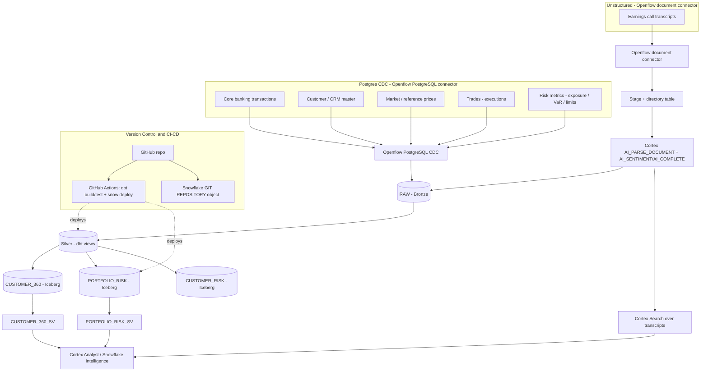

# Architecture

End-to-end data flow for the Finance DE Demo. Structured **trades & risk** and core
banking / CRM / market data arrive via Openflow **PostgreSQL CDC**; **earnings-call
transcripts** arrive via a non-Postgres Openflow **document connector** and are parsed
with Cortex. dbt transforms Bronze -> Silver -> Gold, landing two open Snowflake-managed
Iceberg data products (`CUSTOMER_360`, `PORTFOLIO_RISK`), exposed to AI via semantic
views, a Cortex Search service, and Horizon lineage — all version-controlled with
GitHub and CI/CD.

## Sources
| # | Source | Openflow connector | Lands as |
|---|--------|--------------------|----------|
| 1 | Core banking transactions | PostgreSQL CDC | `RAW.TRANSACTIONS` |
| 2 | Customer / CRM master | PostgreSQL CDC | `RAW.CUSTOMERS` |
| 3 | Market / reference prices | PostgreSQL CDC | `RAW.INSTRUMENT_PRICES` |
| 4 | Trades (executions) | PostgreSQL CDC | `RAW.TRADES` |
| 5 | Risk metrics (exposure/VaR) | PostgreSQL CDC | `RAW.RISK_METRICS` |
| 6 | Earnings call transcripts | Document connector | `RAW.DOC_STAGE` -> `RAW.EARNINGS_TRANSCRIPTS_RAW` |

## Gold data products (Snowflake-managed Iceberg)
- `MARTS.CUSTOMER_360` — relationship value per customer
- `MARTS.PORTFOLIO_RISK` — customer x instrument positions, exposure, P&L + earnings sentiment
- `MARTS.CUSTOMER_RISK` — customer-level exposure, VaR, limit breaches

## AI serving
- `SEMANTIC.CUSTOMER_360_SV`, `SEMANTIC.PORTFOLIO_RISK_SV` — semantic views for Cortex Analyst
- `SEMANTIC.EARNINGS_SEARCH` — Cortex Search service over transcript text
- Horizon lineage from every gold table back to its RAW sources
