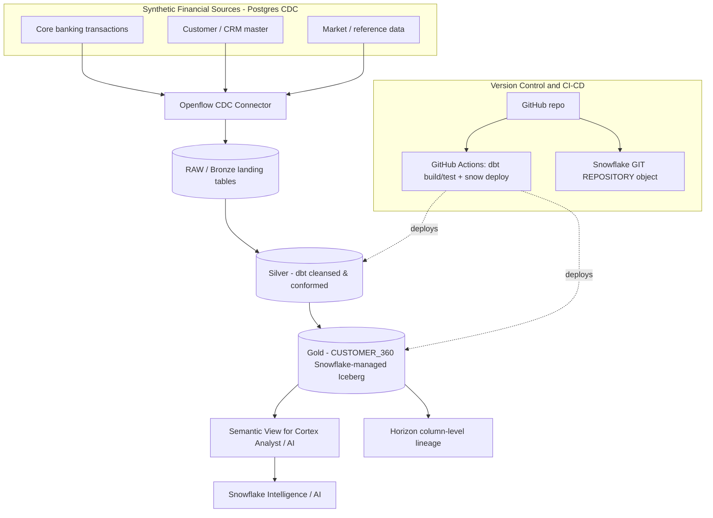

# Architecture

End-to-end data flow for the Finance DE Demo: three financial sources ingested via
Openflow CDC, transformed with dbt through Bronze/Silver/Gold, landed as an open
Snowflake-managed Iceberg gold table, and exposed to AI via a semantic view with
Horizon lineage — all version-controlled with GitHub and CI/CD.

